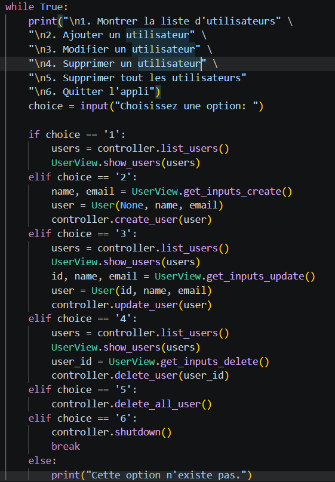
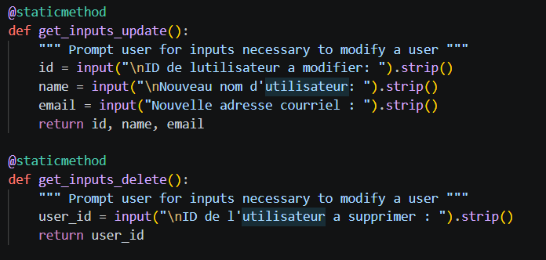
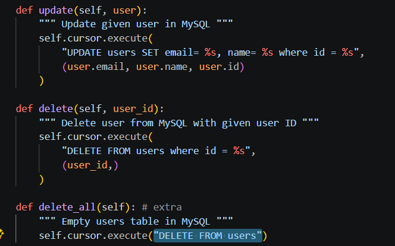
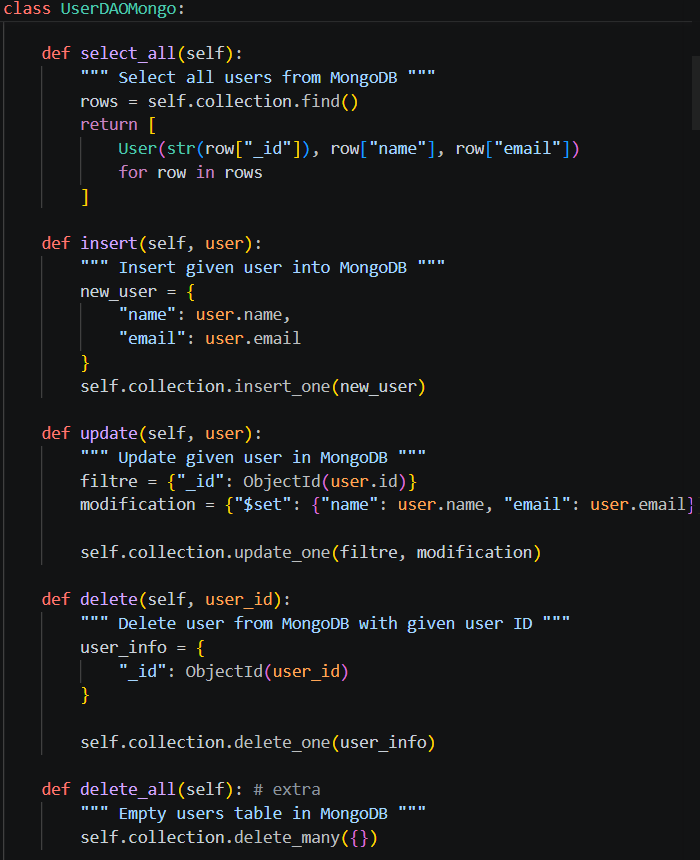

## Rapport Labo 01
-----------------------------

**Question 1** : Quelles commandes avez-vous utilisées pour effectuer les opérations UPDATE et DELETE dans MySQL ? Avez-vous uniquement utilisé Python ou également du SQL ? Veuillez inclure le code pour illustrer votre réponse.

- Commandes MySQL:
 UPDATE: "UPDATE users SET email= %s, name= %s where id = %s"
 DELETE: "DELETE FROM users where id = %s"
 DELETE ALL: "DELETE FROM users"

- Il faut utiliser du code python pour ajouter les différentes options que l'utilisateur peut choisir. Ensuite il faut récuperer les informations entrées. Finalement, il faut envoyer ses informations et utiliser SQL pour modifier la base de donnée.

*Image 1.1 Code python du choix d'options*

*Image 1.2 Code python de l'entrée de l'utilisateur*

*Image 1.3 Code Python + SQL pour modifier la Base de donnée*

-------------------------------
**Question 2** : Quelles commandes avez-vous utilisées pour effectuer les opérations dans MongoDB ? Avez-vous uniquement utilisé Python ou également du SQL ? Veuillez inclure le code pour illustrer votre réponse.

Les commandes pour les opérations: 
- `find()` pour lire les utilisateurs;
- `insert_one()` pour ajouter un utilisateur;
- `update_one()` pour modifier un utilisateur;
- `delete_one()` pour supprimer un utilisateur;
- `delete_many({})` pour supprimer tous les utilisateurs.

J'ai uniquement utiliser du code python puisque j'ai utiliser la librairie pymongo qui sert d'intérmediaire entre mon code et la base de donnée.

*2.1 Image du code pythong pour modifier MongoDB*